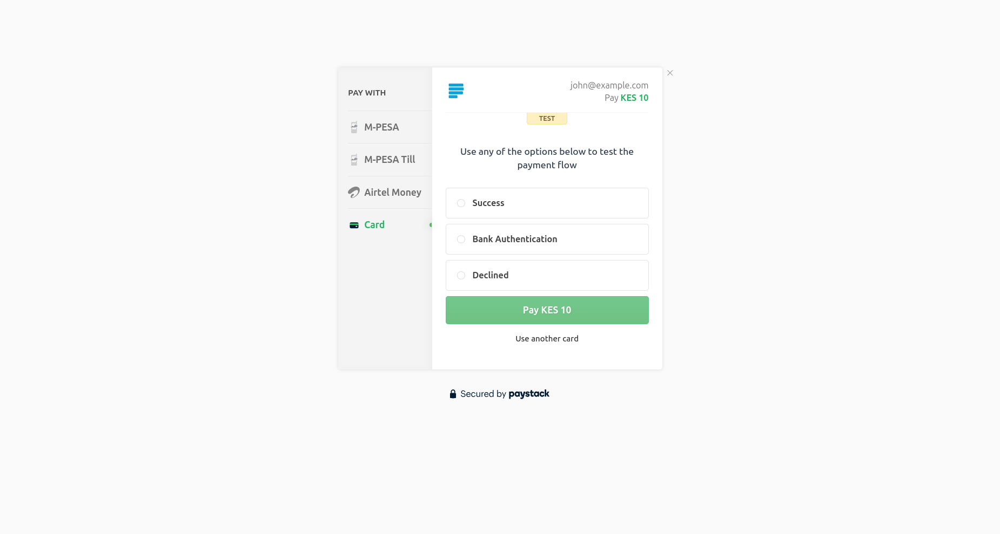

# Payment Gateway API for Small Businesses
This is an API being built according to the specification in [this file](task.md)

The `api` package contains the application code,
`restful_payment_gateway_api` package contains configuration for the Django project.

The API is hosted on [Render](https://render.com/) at https://restful-payment-gateway-api.onrender.com.
The documentation can be found at:
- https://restful-payment-gateway-api.onrender.com/api/v1/schema/swagger-ui (Swagger-UI)
- https://restful-payment-gateway-api.onrender.com/api/v1/schema/redoc (Redoc)
It has the following two endpoints as per the [specification](task.md):
- GET `/api/v1/payments/{id}`
- POST `/api/v1/payments/`

# Setup
[Paystack](https://paystack.com/) is the payment service I decided to go with. 
For both local setup and deployment, you will need to create a Paystack account,
and subsequently a Paystack business so that you can initialise payments, act on them, and get their status.

In particular, you'll need the test secret key, as we'll be working in the test environment,
which you can find on the settings page of your dashboard

## Local setup
1. Clone the repository
    ```bash
   git clone https://github.com/Mirror83/restful_payment_gateway_api.git
   cd restful_payment_gateway_api
    ```
2. Create a virtual environment and activate it (here I'm using .venv)
    ```bash
   # Creating the environment
   python3 -m venv .venv  # Unix-like (Linux, MacOS, Unix)
   py -m venv .venv  # Windows
   
   # Activating it
   source .venv/bin/activate  # Unix-like
   ./.venv/Scripts/Activate.ps1  # Powershell
   ./.venv/Scripts/Activate.bat  # Windows Command Prompt
   ```
3. Install dependencies
    ```bash
    pip install -r requirements.txt
    ```
4. Copy `.env.example` to a `.env` file:
   ```bash
   cp .env.example .env
   ```
   Fill in the required variables
5. Start the development server
    ```bash
   python manage.py runserver
    ```
   The server should be running at http://localhost:8000

Try hitting the initialise payment `POST` endpoint (`/api/v1/payments/`)
with data shaped as follows:
```json
{
  "customer_name": "John Doe",
  "customer_email": "john@example.com",
  "amount": 10.00
}
```
You should get a response that looks like this:
```json
{
  "status": true,
  "message": "Authorization URL created",
  "data": {
    "authorization_url": "https://checkout.paystack.com/u3xwcbi5fezzsf8",
    "reference": "tffgm1m7ju"
  }
}
```
This is basically the response from the Paystack 
[initialise Payment API](https://paystack.com/docs/api/transaction/#initialize).
If you follow the link on the authorisation URL, you'll be taken to the following page:


The page is a test checkout page where you can simulate different payment conditions with different payment channels.
Afterwards, you can try hitting the get payment status `GET` endpoint (`api/v1/payments/{id})` endpoint.
You should get a response similar to this:
```json
{
 "status": true,
 "message": "Verification successful",
 "data": {
   "domain": "test",
   "status": "success",
   "reference": "m392r2dbbn",
   "paid_at": "2025-06-06T11:27:31+03:00",
   "created_at": "2025-06-06T11:26:51+03:00",
   "channel": "mobile_money",
   "currency": "KES",
   "amount": "1000.00"
 }
}
```
   
## Tests
The tests are written using the Django testing framework, and this application
consists of a test class for each view (i.e. endpoint, of which there are two at the moment).
The test classes are subclasses of `django.test.SimpleTestCase` instead of the more common
`django.test.TestCase` since none of the tests require database access.

The test can be divided into the following categories:
1. Validation for incorrect request methods
2. Validation for incorrect input parameters
3. Validation for correct input parameters

The tests can be run as follows (ensure the virtual environment is activated first):
```bash
python manage.py test
```

Alternatively, you can use your IDE to run the tests if you have configured it to do so.

## Deployment
As mentioned before, the application is hosted on Render. The blueprint configuration is in
[render.yaml](render.yaml), and the build script is [build.sh](build.sh).
Check the documentation on 
[how to deploy Django applications to Render](https://render.com/docs/deploy-django#deploying-to-render)
for more details on how the configuration of the two files.

The configuration I have is a bit simpler in that it removes migrations from the build script, and the
database service from the blueprint config, as the application does not need it.

To deploy:
1. You first need to have your repository on a Git hosting service like GitHub.
2. Then create a blueprint deployment on Render, connecting Render to your repo. 
   After a few minutes, the application should be deployed. 
   Try accessing it as described [above](#local-setup).
3. On the settings page of the web service created from the blueprint, change the deployment option from
   `On commit` to `After CI checks pass` to prevent deployment when the tests 
   (the only check in the CI currently) fail.

**N/B:** If your service does not get traffic frequently, Render puts the service to sleep
(if you are on the free plan), so sometimes you may get a `502 Bad Gateway` or a 
`503 Service Unavailable` for a few minutes before the service is restarted,
or the first request may just take a little longer than the others.

